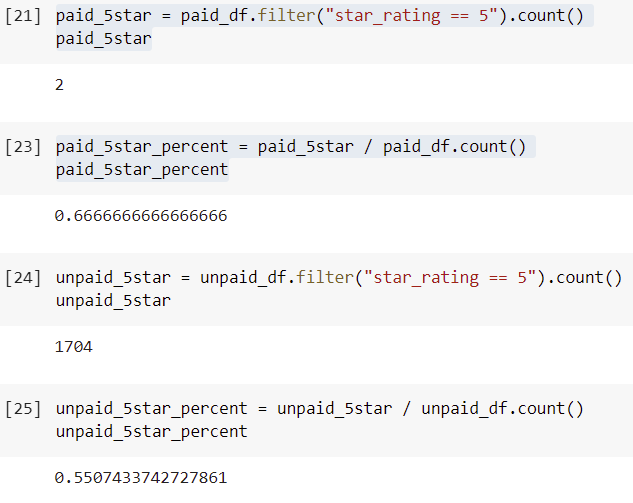

# Amazon_Vine_Analysis\

## Overview of the analysis
In this project, we picked one of the 50 datasets and use PySpark to perform the ETL process to extract the dataset, transform the data, connect to an AWS RDS instance, and load the transformed data into pgAdmin. Next, we used PySpark to determine if there is any bias toward favorable reviews from Vine members in the dataset. 

## Results

From the analysis, we can conclude that:
- There are 3 vine reviews and 

## Summary
