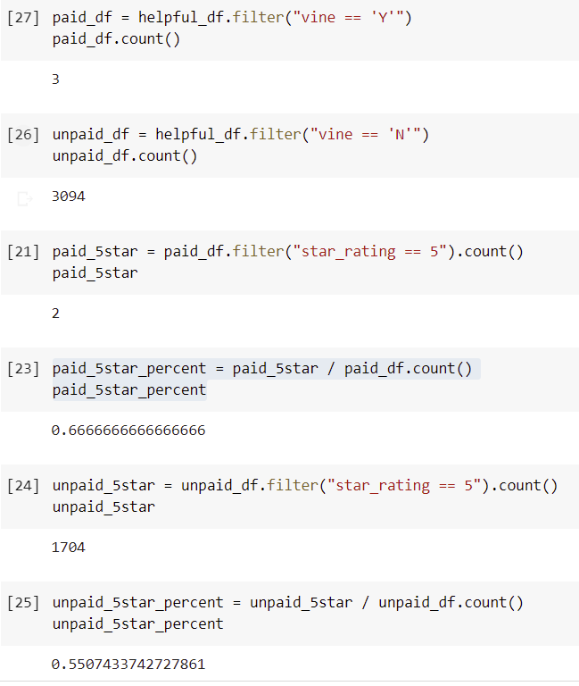

# Amazon_Vine_Analysis\

## Overview of the analysis
In this project, we picked one of the 50 datasets and use PySpark to perform the ETL process to extract the dataset, transform the data, connect to an AWS RDS instance, and load the transformed data into pgAdmin. Next, we used PySpark to determine if there is any bias toward favorable reviews from Vine members in the dataset. 

## Results

From the analysis, we can conclude that:
- There are 3 Vine reviews and 3094 non-Vine reviews.
- Out of the 3 Vine reviews, 2 of them are 5 star. Out of the 3094 non-Vine reviews, 1704 of them are 5 star.
- 66.7% of Vine reviews are 5 star, and 55.1% of non-Vine reviews are 5 star.

## Summary
It seems Vine reviews are more likely to be 5 star. However, there is too few vine reviews to support this conclusion. We could use another dataset to do the same analysis. 

One additional analysis we could do is to find out the average star rating of Vine / non-Vine reviews.
